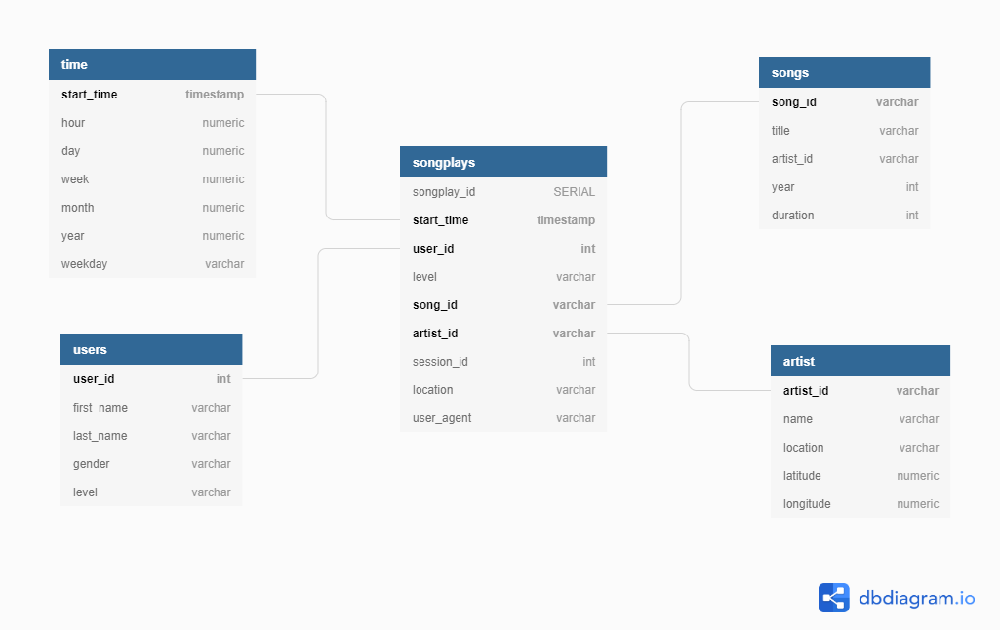

# Database for a music streaming plattform

The Startup stored the data from their app at the moment as .json files.
Json data are complicated to analyze and manipulate store the data in a database make it easier. So that their Data team can extract the data quickly and analyze the behaviors of the users.

## Why I choice a SQL Database

The APP generate always the same data
New files can be add at the same way without any changes
also the data team can access and manipulate the data with simple SQL queries.

## How to use

* Run the create_table.py to create the database and the tables, that are located in the sql_queries.py.

* Run the etl.ipynb to extract the first row of the data and beginn the ETL process.

* Run the etl.py to load the whole data into the database.

## The Star schema of the database

The Star schema is a simple database schema consists of fact and dimension tables with a good performance.
In this schema for the Sparkify DB is the fact table songplays and has four dimension tables named:

* time were stored all time data ((hour, day, month, ...))

* users were stored all user data (first name, lastname, ...)

* songs were stored all song data (title, year, ...)

* artist were stored all artist data (name, location, ...)

