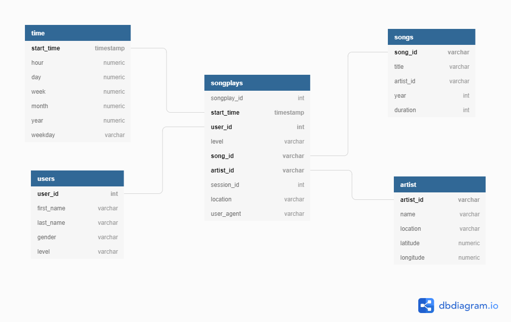

# Database for a music streaming plattform

The Startup stored the data from their app at the moment as .json files.
Json data are dificult to analyse to make it easier the company hired a data engineer to
create a new database for the company. So that their Data team can analyse the data quickly
and understand the behaviors of the users.

## Steps I take to create the Postgres DB

* __E__xtracting data from json file

  * Read the json files into pandas

* __T__ransforming data

  * Bring the data to the 3 Normal Form

  * Create the Database

  * Create the tables based on the data

* __L__oad
  
  * Load the pandas dataframe into the Database

